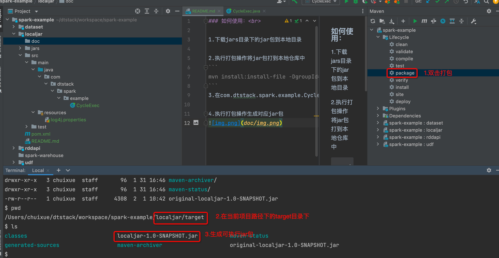
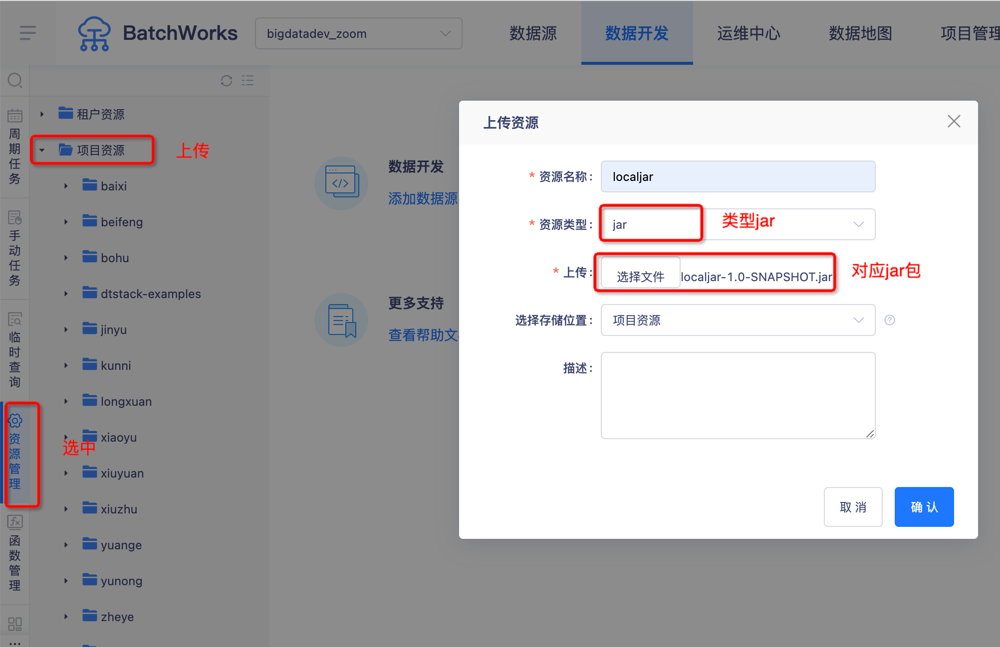
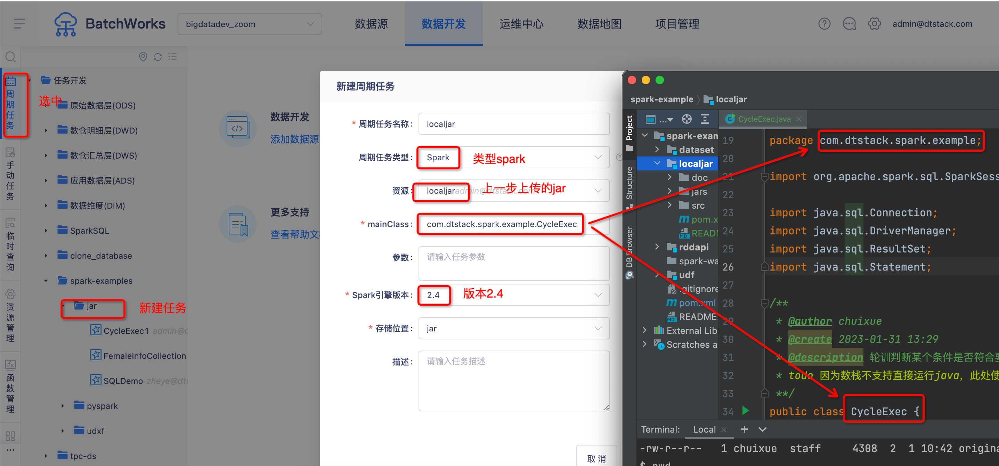

### 如何使用：<br>

1.下载jars目录下的jar包到本地目录

2.执行打包操作将jar包打到本地仓库中
```
mvn install:install-file -DgroupId=com.github.noraui -DartifactId=ojdbc8 -Dversion=12.2.0.1 -Dpackaging=jar -Dfile=ojdbc8-12.2.0.1.jar
```
3.在com.dtstack.spark.example.CycleExec代码中修改逻辑

4.执行打包操作生成对应jar包


5.将jar上传到对应资源目录


6.新建任务执行即可
