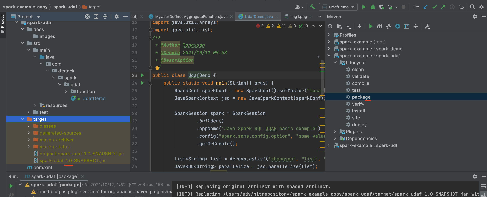
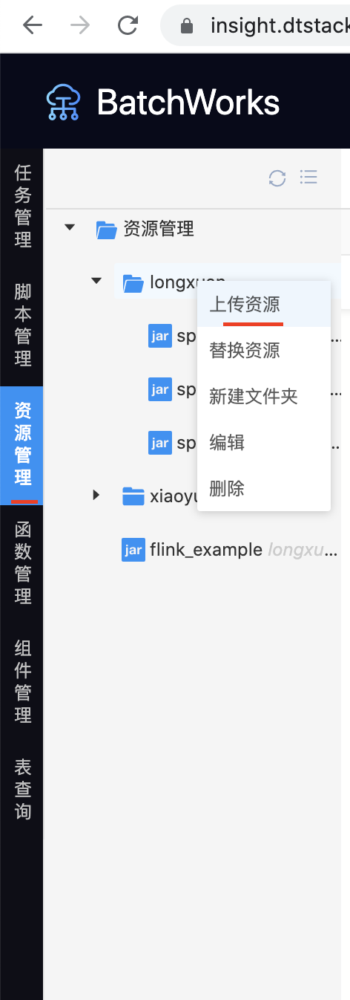
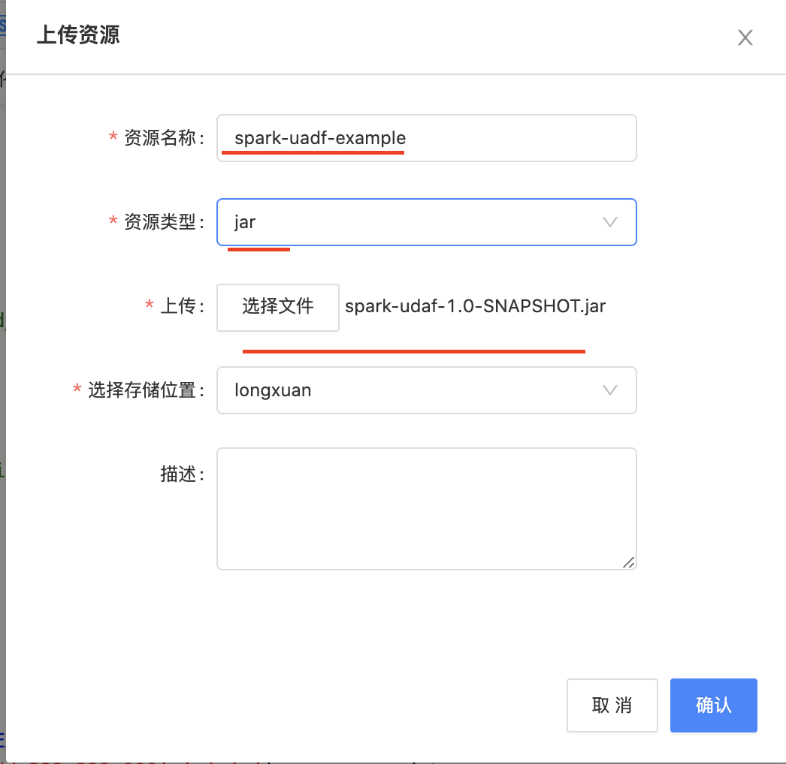
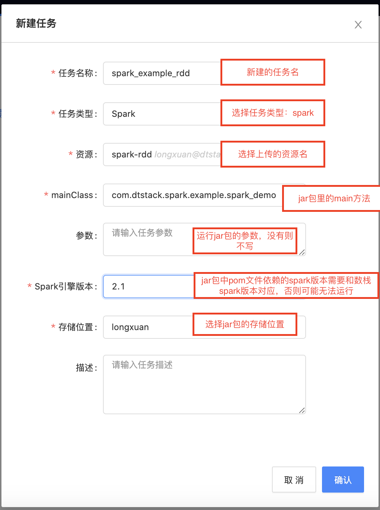
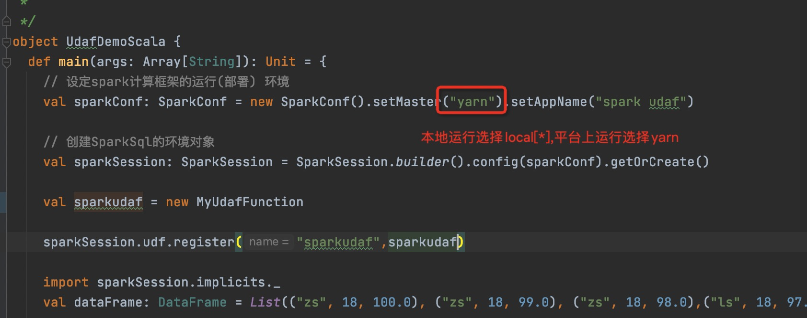
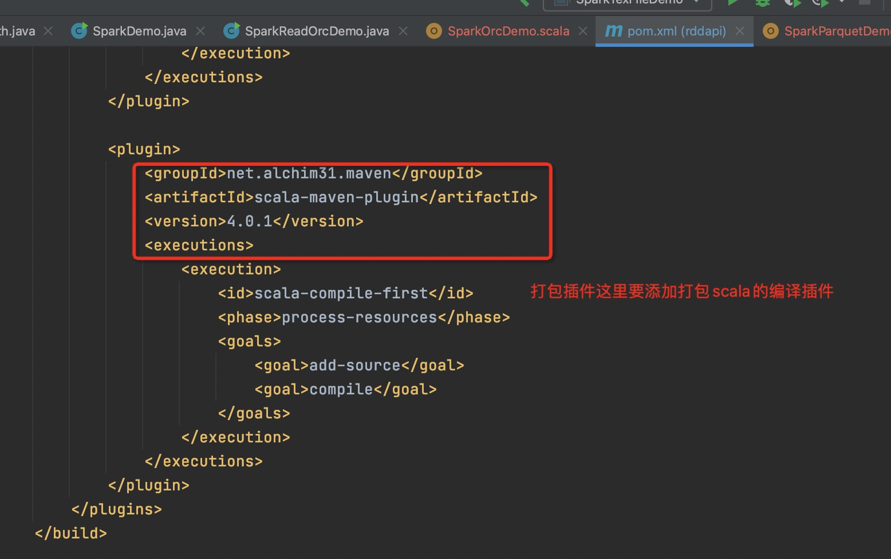

spark-example:基于数栈的spark api demo 
spark sql没有自定义的udtf，可以使用hive的udtf，继承自hive的org.apache.hadoop.hive.ql.udf.generic.GenericUDTF，spark sql的udf函数使用参照rddapi的使用，注册sparkcontext和
sparksession，注册自定义函数使用。
============
如何使用： 
1.在idea工程中打包

2.上传jar包资源

3.编写jar包资源

4.新建spark任务

### 使用scala demo的时候要注意，目前数栈不支持spark的自定义函数，所以在测试的时候结合sparkapi的sparksession进行测试，在提交到平台运行的时候，要选择spark任务进行测试
#### 
#### 